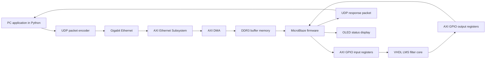

# FPGA Adaptive LMS Filter with Ethernet Interface

Tento repozitář obsahuje hardwarově-softwarový systém pro adaptivní filtraci číslicových signálů na platformě FPGA. Projekt vznikl jako praktická implementační část bakalářské práce na Fakultě elektrotechniky a komunikačních technologií Vysokého učení technického v Brně, Ústav radioelektroniky.

## Základní údaje

| Položka | Hodnota |
|---|---|
| Autor | Tomáš Běčák |
| Instituce | Vysoké učení technické v Brně, FEKT, UREL |
| Typ práce | Bakalářská práce |
| Název práce | Návrh a implementace adaptivního filtru pro zpracování signálů na FPGA |
| Cílová platforma | Digilent Genesys 2, AMD/Xilinx Kintex-7 FPGA |
| Výpočetní jádro | 8-tap adaptivní FIR filtr s algoritmem LMS |
| HDL implementace | VHDL pro LMS filtr, Verilog pro podpůrné periferní bloky |
| Procesorová část | MicroBlaze soft-core procesor |
| Síťová komunikace | Gigabitový Ethernet, AXI Ethernet Subsystem, AXI DMA, lwIP, UDP |
| Číselná reprezentace | Signed fixed-point Q16.16 |
| Testovací data | Radarové profily ve formátu ODIM HDF5 a syntetické testovací vektory |

Základní koncepce projektu vychází z návrhu embedded systému, ve kterém je vlastní matematické jádro LMS filtru realizováno v programovatelné logice a komunikační obsluha je provedena procesorem MicroBlaze. Technické parametry uvedené v této části vycházejí z bakalářské práce, z dokumentace Digilent Genesys 2 a z dokumentace IP jader AMD/Xilinx. Viz zdroje [1], [2], [5], [6], [7].

## Účel projektu

Cílem projektu je ověřit návrh adaptivního filtru realizovaného přímo v FPGA a propojeného s nadřazeným počítačem přes Ethernet. PC aplikace připraví vstupní vzorky, odešle je do FPGA, firmware vzorky předá hardwarovému LMS filtru a výsledek je odeslán zpět do PC k vyhodnocení.

Projekt je zaměřen na tyto oblasti:

- návrh LMS filtru v pevné řádové čárce,
- integraci výpočetního VHDL jádra do systému s procesorem MicroBlaze,
- přenos bloků dat přes Ethernet pomocí UDP,
- převod mezi reálnou reprezentací dat v PC a fixed-point formátem Q16.16,
- ověření časových a frekvenčních vlastností filtrace,
- použití lokálního OLED displeje pro diagnostiku stavu systému.

## Systémová architektura

Systém je navržen jako uzavřená datová smyčka mezi PC a vývojovou deskou Digilent Genesys 2.



Rozhraní Ethernet a DMA slouží pouze pro transport dat. VHDL jádro LMS filtru nepracuje s Ethernet rámci, IP hlavičkami ani UDP hlavičkami. Do filtru vstupují až demultiplexované vzorky `x(n)` a `d(n)` ve formátu Q16.16. Tím je matematická část návrhu oddělena od transportní vrstvy, což usnadňuje simulaci, ladění a pozdější výměnu komunikačního rozhraní.

Zdroje: [1], [2], [5], [6], [7], [8].

## Datová cesta

1. PC aplikace načte nebo vygeneruje vstupní data.
2. Data jsou normalizována a převedena do signed fixed-point formátu Q16.16.
3. Dvojice vzorků `x(n)` a `d(n)` jsou zabalena do binárního UDP payloadu.
4. Ethernetový subsystém ve FPGA přijme datagram.
5. AXI DMA uloží přijatá data do paměti.
6. Firmware běžící na MicroBlaze provede validaci hlavičky, kontrolu pořadí paketu a převod endianity.
7. Firmware zapíše vzorky do AXI GPIO registrů připojených k LMS filtru.
8. VHDL jádro vypočte filtrovaný výstup `y(n)` a chybový signál `e(n)`.
9. Výsledky jsou zapsány zpět do registrů, přečteny firmwarem a odeslány zpět do PC.
10. PC aplikace provede zpětný převod do reálných hodnot, vizualizaci a výpočet metrik.

## Aplikační UDP payload

Přenos používá binární aplikační formát. Důvodem je nižší režie oproti textovému formátu a jednodušší parsování v embedded firmwaru.

| Položka | Velikost | Význam |
|---|---:|---|
| `MAGIC` | 4 B | Synchronizační identifikátor platného aplikačního paketu |
| `SEQ` | 4 B | Sekvenční číslo pro detekci ztráty nebo prohození paketů |
| `COUNT` | 2 B | Počet vzorků v datové části |
| `FLAGS` | 2 B | Řídicí příznaky, například režim filtru nebo nulování vah |
| `x(n)` | 4 B na vzorek | Vstupní vzorek ve formátu signed Q16.16 |
| `d(n)` | 4 B na vzorek | Referenční vzorek ve formátu signed Q16.16 |

Jeden signálový bod tvořený dvojicí `x(n)` a `d(n)` zabírá 8 bajtů. Pro blok 64 vzorků má užitečná datová část 512 bajtů. Při započtení 12bajtové aplikační hlavičky zůstává paket pod běžnou ethernetovou MTU 1500 bajtů, takže není nutná fragmentace na IP vrstvě.

Zpětný paket používá stejnou strukturu. Místo vstupních dat vrací `y(n)` a `e(n)`.

Zdroje: [1], [6], [8].

## Fixed-point reprezentace Q16.16

Všechny hlavní signálové hodnoty přenášené mezi PC, firmwarem a hardwarovým filtrem jsou reprezentovány jako 32bitové signed fixed-point hodnoty Q16.16.

Převod z reálné hodnoty do fixed-point formátu:

```text
x_q16_16 = round(x * 2^16)
```

Zpětný převod do reálné hodnoty:

```text
x = x_q16_16 / 2^16
```

Důvody použití Q16.16:

- 32bitová šířka odpovídá běžné šířce AXI4-Lite registrů a usnadňuje přenos přes MicroBlaze,
- 16bitová celočíselná část poskytuje rezervu pro mezivýsledky při násobení a akumulaci,
- 16bitová zlomková část poskytuje dostatečné rozlišení pro ověřovací signálové vektory,
- jednotný formát snižuje počet konverzí mezi PC aplikací, firmwarem a VHDL jádrem,
- formát je vhodný pro mapování aritmetických operací na DSP bloky FPGA.

Formát Q1.31 by poskytl vyšší frakční rozlišení pro striktně normalizovaná data v intervalu přibližně od -1 do 1, ale měl by minimální rezervu pro vnitřní akumulační operace LMS algoritmu. Pro další verzi systému je vhodné zvážit oddělení formátu vstupních vzorků a formátu vnitřních akumulátorů, například vstupy v Q1.31 a výpočetní akumulaci v širším interním formátu se saturací.

Zdroje: [1], [5], [8].

## LMS filtr

Výpočetní jádro je realizováno jako adaptivní FIR filtr s algoritmem LMS. Pro každý časový krok se počítá výstup filtru, chybový signál a aktualizace váhových koeficientů.

Základní vztahy:

```text
y(n) = sum(w_i(n) * x(n-i))
e(n) = d(n) - y(n)
w_i(n+1) = w_i(n) + mu * e(n) * x(n-i)
```

Kde:

- `x(n)` je vstupní signál,
- `d(n)` je referenční signál,
- `y(n)` je výstup filtru,
- `e(n)` je okamžitý chybový signál,
- `w_i(n)` jsou adaptivní váhy filtru,
- `mu` je adaptační krok.

LMS byl zvolen kvůli nízké výpočetní složitosti, přímé realizovatelnosti pomocí násobení a akumulace a vhodnosti pro implementaci v FPGA. Složitější algoritmy, například NLMS nebo RLS, jsou vhodné pro další srovnání, ale vyžadují dělení, normalizaci energie vstupního vektoru nebo maticové operace, což výrazně zvyšuje nároky na hardwarové prostředky.

Zdroje: [1], [12], [13].

## Ethernetová vrstva a inspirace projektem Nexys Video

Ethernetová část projektu je realizována na vývojové desce Digilent Genesys 2. Deska Genesys 2 obsahuje ethernetový PHY Realtek RTL8211E-VL připojený k FPGA přes RGMII pro data a MDIO pro management. Stejný typ PHY a velmi podobnou síťovou topologii používá také Digilent Nexys Video.

Návrh ethernetové části tohoto projektu byl inspirován oficiálním řešením pro Nexys Video, zejména koncepcí MicroBlaze + AXI Ethernet Subsystem + lwIP. Inspirace se týká systémové architektury síťové části, způsobu zapojení MAC/PHY vrstvy a obsluhy síťového stacku v procesorovém systému. Implementace byla přizpůsobena desce Genesys 2, jejím pinovým vazbám, napěťovým bankám, hodinovým doménám a cílové datové cestě LMS filtru.

Důležité vymezení:

- constraints pro Ethernet musí odpovídat desce Genesys 2, nikoli desce Nexys Video,
- RGMII časování je nutné ověřit pro konkrétní hodinové domény a fyzické piny Genesys 2,
- AXI Ethernet Subsystem zajišťuje MAC vrstvu, zatímco Realtek RTL8211E-VL zajišťuje fyzickou vrstvu,
- lwIP je použit ve firmwaru pro zpracování IP/UDP vrstvy,
- UDP byl zvolen pro nízkou režii při blokovém přenosu dat v lokální síti.

Zdroje: [2], [3], [5], [6], [7], [11].

## OLED displej a původ převzatých částí

Deska Digilent Genesys 2 obsahuje vestavěný monochromatický OLED displej UG-2832HSWEG04 s řadičem SSD1306. Displej má rozlišení 128 x 32 bodů a používá čtyřvodičové sériové rozhraní SPI. Podle referenčního manuálu Genesys 2 je nutné řídit také reset a napájecí sekvenci displeje.

Podpora OLED displeje v tomto projektu je zčásti převzata z oficiálních zdrojů Digilent pro Genesys 2 a následně přepsána pro potřeby tohoto projektu. Upravená verze je použita jako diagnostická periferie pro zobrazení IP adresy, stavu síťového spojení, režimu filtru a případných chybových příznaků. OLED není hlavní výpočetní částí práce; slouží jako lokální servisní a diagnostický výstup nezávislý na PC aplikaci a UART terminálu.

Při použití převzatých nebo částečně převzatých souborů z oficiálních ukázkových projektů Digilent musí zůstat zachováno původní licenční záhlaví a informace o autorství. Zdrojový kód ukázky Genesys 2 Out-of-Box Demo je uveden jako software Digilent a obsahuje licencování typu BSD 3-Clause. Vlastní úpravy pro tento projekt mají být v repozitáři jasně odděleny od původních částí Digilent.

Zdroje: [2], [4], [9], [10].

## Adresářová struktura

Doporučená struktura repozitáře:

```text
.
├── fpga/
│   ├── rtl/
│   │   ├── lms_filter/
│   │   ├── axi_bridge/
│   │   └── oled/
│   ├── constraints/
│   ├── sim/
│   ├── scripts/
│   └── vivado/
├── firmware/
│   ├── src/
│   ├── include/
│   └── vitis/
├── python/
│   ├── main.py
│   ├── requirements.txt
│   ├── src/
│   └── tests/
├── data/
│   ├── input/
│   ├── processed/
│   └── README.md
├── doc/
│   ├── block_diagrams/
│   ├── timing/
│   └── reports/
├── LICENSE
└── README.md
```

Popis hlavních složek:

| Složka | Obsah |
|---|---|
| `fpga/rtl/lms_filter` | VHDL implementace LMS filtru |
| `fpga/rtl/axi_bridge` | Propojovací logika mezi MicroBlaze registry a výpočetním jádrem |
| `fpga/rtl/oled` | Upravený OLED řadič a zobrazovací logika |
| `fpga/constraints` | XDC soubory pro Genesys 2 |
| `fpga/sim` | Testbenche pro HDL simulaci |
| `fpga/scripts` | Tcl skripty pro reprodukovatelné sestavení projektu |
| `firmware/src` | C firmware pro MicroBlaze |
| `python/src` | PC aplikace pro přípravu dat, UDP přenos a vyhodnocení |
| `data` | Testovací vstupy a zpracované vektory |
| `doc` | Schémata, protokoly z měření, časové diagramy a implementační reporty |

## Reprodukce projektu

### 1. Hardwarový projekt ve Vivadu

Požadavky:

- AMD/Xilinx Vivado,
- licence a IP jádra potřebná pro AXI Ethernet Subsystem,
- deska Digilent Genesys 2,
- odpovídající XDC soubor pro Genesys 2.

Doporučený postup:

```tcl
cd fpga/scripts
source recreate_project.tcl
```

Následně ve Vivadu:

```text
Run Synthesis
Run Implementation
Generate Bitstream
Open Hardware Manager
Program Device
```

Po úspěšné implementaci je vhodné uložit minimálně tyto reporty:

- utilization report,
- timing summary,
- power report,
- DRC report,
- případně CDC report, pokud návrh obsahuje přechody mezi hodinovými doménami.

Zdroje: [2], [5], [6], [7].

### 2. Firmware ve Vitis

Požadavky:

- exportovaný hardwarový soubor XSA z Vivada,
- Vitis Unified Software Platform,
- BSP obsahující ovladače AXI DMA, AXI GPIO, AXI Ethernet a lwIP.

Doporučený postup:

1. Importovat XSA do Vitis.
2. Vytvořit platform project.
3. Vygenerovat BSP.
4. Přeložit firmware ze složky `firmware/src`.
5. Nahrát bitstream a spustit aplikaci na MicroBlaze.
6. Ověřit výpis stavu přes UART a lokální zobrazení na OLED.

Zdroje: [5], [6], [7], [11].

### 3. PC aplikace v Pythonu

Požadavky:

- Python 3,
- NumPy,
- SciPy,
- Matplotlib,
- h5py,
- síťová karta nastavená do stejné podsítě jako FPGA.

Instalace závislostí:

```bash
cd python
pip install -r requirements.txt
```

Spuštění základního přenosu:

```bash
python main.py --input ../data/input/radar_profile.csv
```

Doporučené výstupy PC aplikace:

- CSV se vstupním, referenčním a filtrovaným signálem,
- graf časového průběhu `x(n)`, `d(n)`, `y(n)`,
- graf chybového signálu `e(n)`,
- FFT spektra vstupního a výstupního signálu,
- metriky MSE a SNR,
- log sekvenčních čísel UDP paketů.

Zdroje: [1], [8], [14], [15].

## Testovací data

Projekt může pracovat se syntetickými vektory i s radarovými daty. Radarová data jsou používána jako reálnější testovací vstup, protože obsahují prostorově proměnnou strukturu a větší dynamický rozsah než jednoduchý sinusový signál. V práci jsou uváděna data ve formátu ODIM HDF5, který je používaný pro meteorologická radarová data.

Při práci s radarovými daty musí být v repozitáři jednoznačně uvedeno:

- odkud data pocházejí,
- jaký produkt je použit, například DBZH,
- jaký řez nebo profil byl vybrán,
- jak byla data normalizována,
- jak byl vytvořen vstupní signál `x(n)`,
- jak byl vytvořen referenční signál `d(n)`,
- jaký typ šumu nebo rušení byl přidán,
- jaká metrika byla použita k vyhodnocení filtrace.

Bez těchto údajů nelze objektivně posoudit, zda adaptivní filtr data skutečně zlepšuje.

Zdroje: [1], [8], [14], [15].

## Verifikace

Pro profesionální reprodukovatelnost projektu se doporučuje doložit minimálně tyto úrovně ověření:

| Úroveň | Ověření | Požadovaný důkaz |
|---|---|---|
| HDL simulace | LMS filtr nad známými vektory | Testbench, průběhy, shoda s Python modelem |
| Fixed-point model | Q16.16 proti floating-point referenci | Tabulka odchylek a MSE |
| Firmware | Parsování UDP payloadu a endianity | Log paketů, kontrola `SEQ`, `COUNT`, `MAGIC` |
| Ethernet | Přenos PC -> FPGA -> PC | Wireshark záznam nebo log aplikace |
| Integrace | MicroBlaze -> AXI GPIO -> LMS -> AXI GPIO | Registrační dump nebo debug log |
| OLED | Zobrazení IP adresy a stavu | Fotografie nebo video z běhu |
| Implementace | Syntéza, implementace, timing closure | Vivado reporty |
| Výsledky filtrace | `x(n)`, `d(n)`, `y(n)`, `e(n)` | CSV a grafy |

## Známá technická omezení

- UDP neposkytuje garanci doručení ani zachování pořadí datagramů. Proto je v aplikační hlavičce použito sekvenční číslo a počet vzorků.
- Krátké testovací bloky jsou vhodné pro ověření funkce, ale nemusejí plně reprezentovat chování celé radarové mapy.
- Q16.16 je kompromis mezi dynamickým rozsahem a frakční přesností. Pro čistě normalizovaná data může být vhodnější jiný formát.
- OLED řadič je diagnostická periferie. Neprokazuje správnost filtrace, pouze stav systému.
- Síťová část inspirovaná deskou Nexys Video musí být vždy přizpůsobena konkrétním pinům, bankám a časování desky Genesys 2.
- Přímé převzetí kódu Digilent vyžaduje zachování licenčních hlaviček a uvedení původu.

## Autorské vymezení

Autorskými částmi tohoto projektu jsou zejména:

- návrh a implementace LMS výpočetního jádra,
- návrh datového toku mezi firmwarem a hardwarovým filtrem,
- fixed-point reprezentace a převod dat,
- aplikační UDP formát pro přenos signálových vzorků,
- Python nástroje pro přípravu a vyhodnocení dat,
- integrace jednotlivých bloků do cílové architektury projektu.

Částečně převzaté nebo inspirované části:

| Oblast | Původ | Způsob použití |
|---|---|---|
| Ethernetová systémová koncepce | Digilent Nexys Video Ethernet/MicroBlaze projekty a dokumentace | Inspirace architekturou, upraveno pro Genesys 2 |
| OLED řadič | Oficiální Digilent Genesys 2 OLED a Out-of-Box demo zdroje | Částečně převzato a přepsáno pro diagnostiku projektu |
| Deskové constraints | Digilent Genesys 2 reference/XDC zdroje | Nutné přizpůsobení pinům Genesys 2 |
| Síťový stack | lwIP | Použití otevřeného TCP/IP stacku ve firmwaru |
| IP jádra | AMD/Xilinx | Použití MicroBlaze, AXI DMA a AXI Ethernet Subsystem |

## Doporučené citování projektu

```text
BĚČÁK, Tomáš. Návrh a implementace adaptivního filtru pro zpracování signálů na FPGA.
Bakalářská práce. Brno: Vysoké učení technické v Brně, Fakulta elektrotechniky
a komunikačních technologií, Ústav radioelektroniky, 2026.
```

## Licence

Licenci celého repozitáře je nutné zvolit podle skutečného obsahu odevzdaných souborů. Pokud repozitář obsahuje části převzaté z ukázkových projektů Digilent, musí být zachovány jejich původní licenční podmínky a copyright hlavičky. Pro vlastní zdrojové soubory projektu lze zvolit samostatnou licenci, například MIT nebo BSD 3-Clause, pokud to není v rozporu s licencemi převzatých částí.

## Zdroje

[1] BĚČÁK, Tomáš. Návrh a implementace adaptivního filtru pro zpracování signálů na FPGA. Bakalářská práce. Brno: VUT FEKT, Ústav radioelektroniky, 2026.

[2] Digilent. Genesys 2 FPGA Board Reference Manual. Dostupné z: https://digilent.com/reference/_media/reference/programmable-logic/genesys-2/genesys2_rm.pdf. Citováno 2026-06-10.

[3] Digilent. Nexys Video FPGA Board Reference Manual. Dostupné z: https://digilent.com/reference/_media/reference/programmable-logic/nexys-video/nexys-video_rm.pdf. Citováno 2026-06-10.

[4] Digilent. Genesys 2 OLED Demo. Dostupné z: https://github.com/Digilent/Genesys-2-OLED. Citováno 2026-06-10.

[5] AMD. MicroBlaze Processor Reference Guide, UG984. Dostupné z: https://docs.amd.com/r/en-US/ug984-vivado-microblaze-ref. Citováno 2026-06-10.

[6] AMD. AXI DMA LogiCORE IP Product Guide, PG021. Dostupné z: https://docs.amd.com/r/en-US/pg021_axi_dma. Citováno 2026-06-10.

[7] AMD. AXI 1G/2.5G Ethernet Subsystem Product Guide, PG138. Dostupné z: https://docs.amd.com/r/en-US/pg138-axi-ethernet. Citováno 2026-06-10.

[8] lwIP. Raw API documentation. Dostupné z: https://www.nongnu.org/lwip/2_1_x/group__callbackstyle__api.html. Citováno 2026-06-10.

[9] Digilent. Genesys 2 Root Repository. Dostupné z: https://github.com/Digilent/Genesys-2. Citováno 2026-06-10.

[10] Digilent. Genesys 2 Out-of-Box Demo source code. Dostupné z: https://github.com/Digilent/Genesys2/blob/master/Projects/user_demo/sdk/g2demo/src/demo.c. Citováno 2026-06-10.

[11] Digilent. Getting Started with MicroBlaze Servers for Nexys Video. Dostupné z: https://digilent.com/reference/nexys/nexysvideo/gsmbs. Citováno 2026-06-10.

[12] HAYKIN, Simon. Adaptive Filter Theory. 5th ed. Pearson, 2013.

[13] WIDROW, Bernard; STEARNS, Samuel D. Adaptive Signal Processing. Prentice Hall, 1985.

[14] EUMETNET OPERA. ODIM HDF5 v2.4: OPERA Data Information Model for HDF5. Dostupné z: https://www.eumetnet.eu/wp-content/uploads/2021/07/ODIM_H5_v2.4.pdf. Citováno 2026-06-10.

[15] ČHMÚ. Popis radarových dat na serveru opendata.chmi.cz. Dostupné z: https://opendata.chmi.cz/meteorology/weather/radar/radar_popis_cz.pdf. Citováno 2026-06-10.
